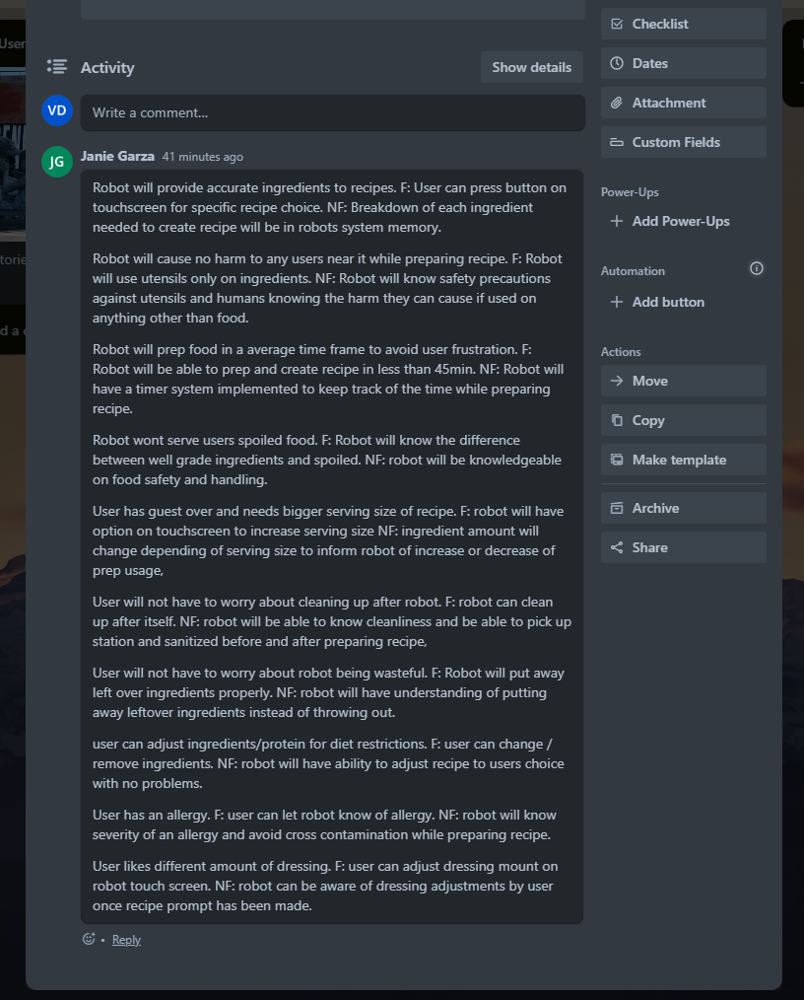
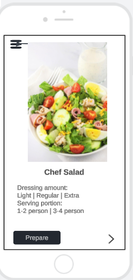

# Chefs Salad 
1. How will robot memorize ingredients for chef salad recipe?
2. How will robot opperate when preparing recipe around humans?
3. How long will robot take to prepare recipe?
4. How will robot identify if ingredients are spoiled?
5. How will the robot know portion/serving size needed?
6.  How will the robot clean after itself?
7.  How will robot identify to save/put away left over ingredients?
8.  How will robot identify protien changes in salad?
9.  How will robot know when to accept an 86 request?
10. How will robot accommodate to dressing level preference?
    

[Previous](/TY.md) [Main page](/README.md) [Next](/Victor.md)
