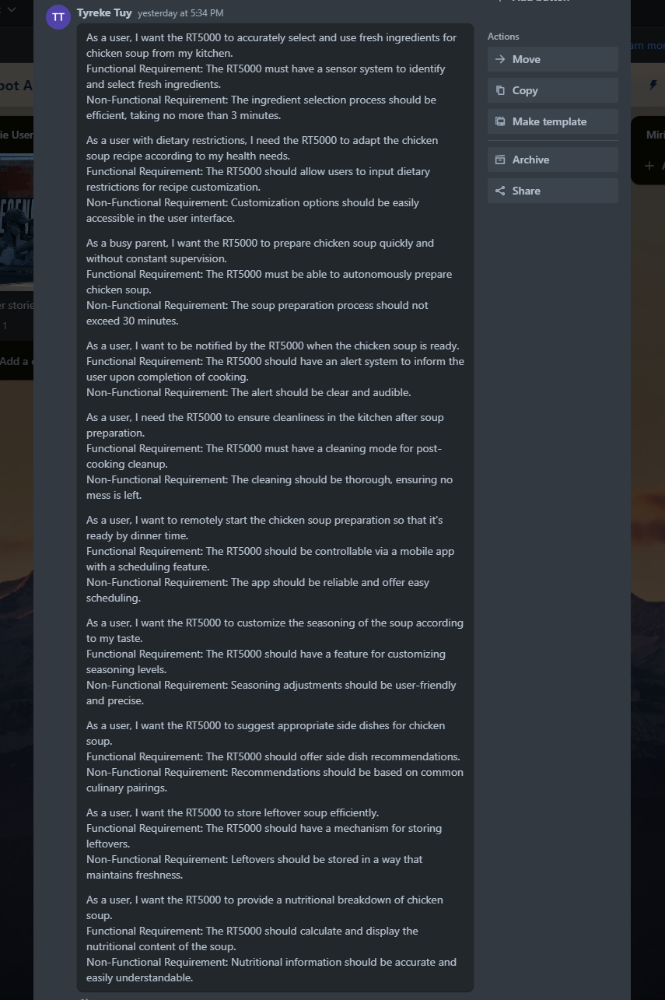
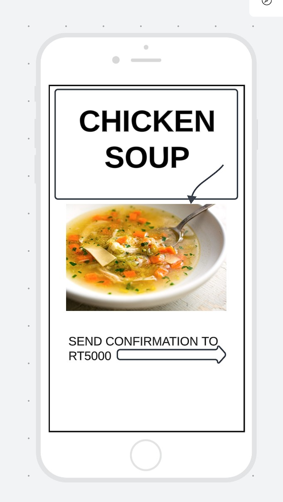

## Chicken Soup
1. How will the RT5000 identify and select the necessary ingredients for chicken soup from the kitchen storage?
2. What specific steps should the RT5000 follow to prepare the chicken soup, including handling raw chicken?
3. Can users customize the recipe via the app, such as adding or omitting ingredients, and how will the RT5000 adapt to these changes?
4. How does the RT5000 manage the cooking process, including adjusting temperatures and stirring the soup?
5. How will the RT5000 determine the quantity of soup to prepare based on user input or predefined settings?
6. What is the expected total time for preparing and cooking the soup, and how does the RT5000 communicate this to the user?
7. How does the RT5000 serve the soup once it's ready? Does it pour it into bowls, and if so, how does it handle hot liquids safely?
8. How does the RT5000 ensure cleanliness and safety, especially when handling raw chicken and hot liquids?
9. What procedures does the RT5000 follow if an ingredient is missing or if there's an issue during the cooking process?
10. Does the RT5000 have the capability to store leftovers, and if so, how does it handle this task?

                      [Main page](/README.md)                    [Next](/Janie.md)
