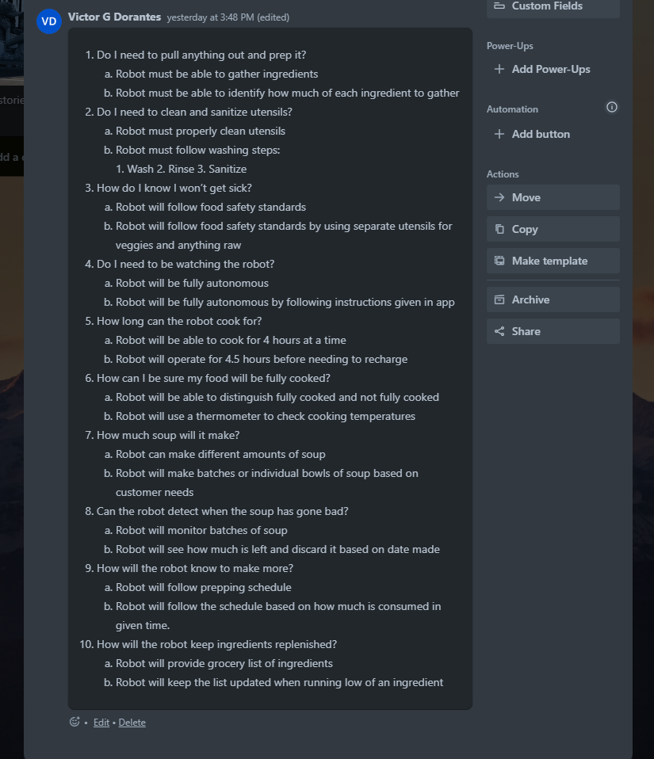

## Chili and Rice (Victor)

1. How will the robot gather ingredients?
2. How will the robot clean their untensils?
3. How will the robot follow food saftey standards?
4. Will the app/robot need approval from food saftey department?
5. Will the robot need supervision?
6. How many hours should the robot be functioning in a day?
7. How will the robot keep ingredients in stock?
8. How will the robot recognize when the soup is fully cooked?
9. Will the robot make batches or items to order?
10. If batching, how will the robot know to make more?

